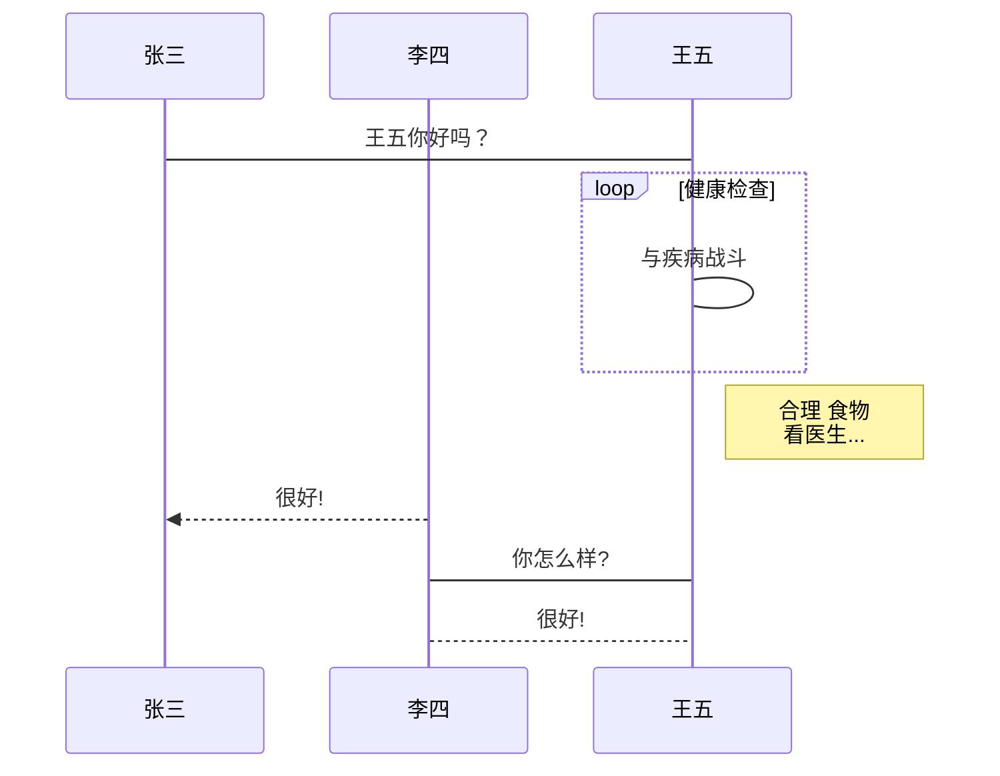
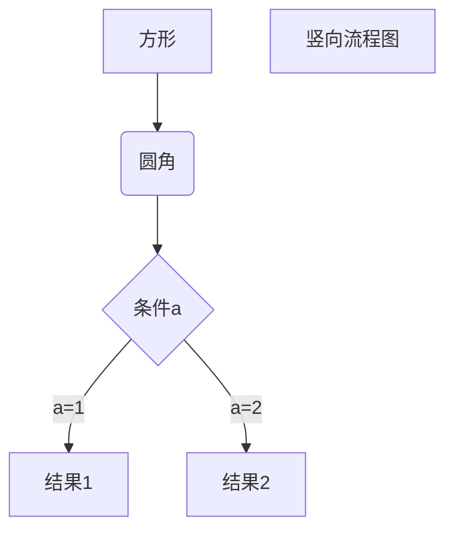
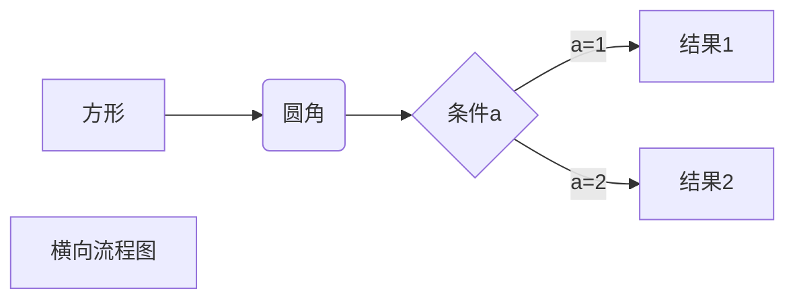
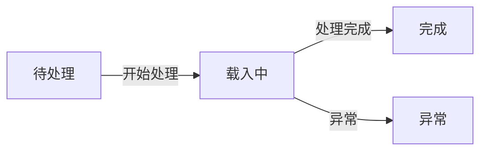

------



------

```sequence
Title:连接建立的过程
客户主机->服务器主机: 连接请求（SYN=1,seq=client_isn） 
服务器主机->客户主机: 授予连接（SYN=1,seq=client_isn）\n ack=client_isn+1
客户主机->服务器主机: 确认（SYN=0,seq=client_isn+1）\nack=server_isn+1

```

```sequence
Title: 标题：复杂使用

对象A->对象B: 对象B你好吗?（请求）

Note right of 对象B: 对象B的描述

Note left of 对象A: 对象A的描述(提示)

对象B-->对象A: 我很好(响应)

对象B->小三: 你好吗

小三-->>对象A: 对象B找我了

对象A->对象B: 你真的好吗？

Note over 小三,对象B: 我们是朋友

participant C

Note right of C: 没人陪我玩
```

```flow
st=>start: Start|past:>http://www.google.com[blank]
e=>end: End:>http://www.google.com
op1=>operation: My Operation|past
op2=>operation: Stuff|current
sub1=>subroutine: My Subroutine|invalid
cond=>condition: Yes 
or No?|approved:>http://www.baidu.com
c2=>condition: Good idea|rejected
io=>inputoutput: catch something...|request

st->op1(right)->cond
cond(yes, right)->c2
cond(no)->sub1(left)->op1
c2(yes)->io->e
c2(no)->op2->e

作者：lly源
链接：https://www.jianshu.com/p/a9ff5a9cdb25
來源：简书
简书著作权归作者所有，任何形式的转载都请联系作者获得授权并注明出处。
```







